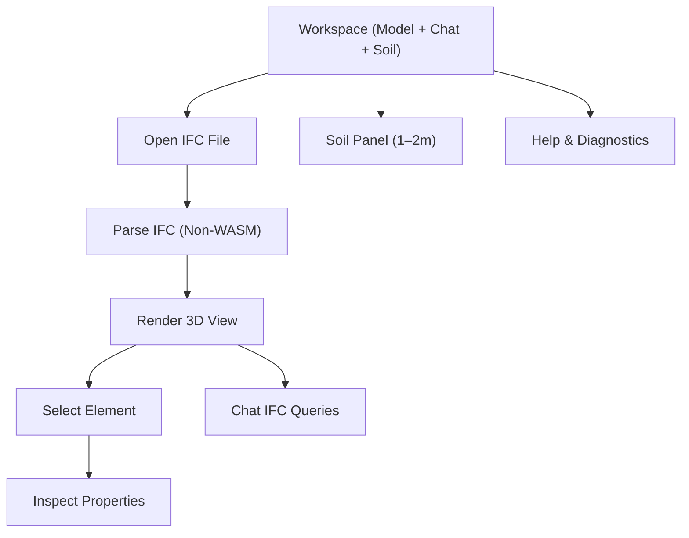

## 1. Product Overview
Replace the current IFC/WASM viewer with an IFClite-style (non-WASM) IFC parser + renderer that runs without WebAssembly.
You keep the existing “chat with IFC” query experience, and you constrain the Soil UI to only display depths from 1–2 meters.

## 2. Core Features

### 2.1 User Roles
Role separation is not required. The product is used by a single user type.

### 2.2 Feature Module
Our requirements consist of the following main pages:
1. **Workspace (Model + Chat + Soil)**: open IFC, parse & render 3D model, inspect elements, chat IFC queries, soil panel (depth-limited).
2. **Help & Diagnostics**: viewer capability notes, parsing status/errors, performance metrics.

### 2.3 Page Details
| Page Name | Module Name | Feature description |
|-----------|-------------|---------------------|
| Workspace (Model + Chat + Soil) | IFC file open | Select IFC file from device and start loading; show file name, size, and last opened timestamp. |
| Workspace (Model + Chat + Soil) | Non-WASM IFC parsing pipeline | Parse IFC STEP text in-browser (no wasm); build entity index; stream progress; fail gracefully with actionable errors. |
| Workspace (Model + Chat + Soil) | 3D viewport | Render parsed geometry; support orbit/pan/zoom, reset view, fit-to-model, section toggle (on/off), and screenshot export. |
| Workspace (Model + Chat + Soil) | Element selection & inspection | Click element to highlight; show properties (GlobalId, name, type, key attributes); allow “focus selected” and “copy GlobalId”. |
| Workspace (Model + Chat + Soil) | Model structure browser | Browse model tree by IFC type and/or spatial structure; search by name/GlobalId; select item to highlight in viewport. |
| Workspace (Model + Chat + Soil) | Chat IFC queries (kept) | Ask natural-language questions about the IFC; show streaming responses; allow inserting selected element context (e.g., GlobalId) into prompt; keep existing chat UX and history behavior. |
| Workspace (Model + Chat + Soil) | Soil UI (depth limited) | Display soil-related charts/3D profile but only for depth range 1–2m; disallow selecting outside range; label clearly “Depth 1–2m”. |
| Workspace (Model + Chat + Soil) | Status & errors | Show top status bar with loading %, parse time, triangles count (if available), and non-blocking warnings. |
| Help & Diagnostics | Capability & limitations | Explain what IFC constructs are supported by the non-WASM pipeline and what fallbacks occur when unsupported geometry is encountered. |
| Help & Diagnostics | Debug report export | Export a diagnostics bundle (timestamps, errors, browser info, parser version, sample stats) for support. |

## 3. Core Process
**Model viewing flow**
1. You open the Workspace and choose an IFC file.
2. The app parses the IFC (no wasm), building an entity index and geometry buffers while showing progress.
3. The 3D viewport renders the model; you inspect elements via click or the model tree.

**Chat IFC query flow (kept)**
1. You type a question in Chat (optionally “attach” the currently selected element).
2. The app sends your prompt (and selected element context) to the existing chat query pipeline.
3. The assistant answers while streaming; you can follow up and keep history.

**Soil depth flow (restricted)**
1. You open the Soil panel.
2. The app shows soil outputs only for 1–2m depth (fixed range); any control that would go beyond the range is disabled.

