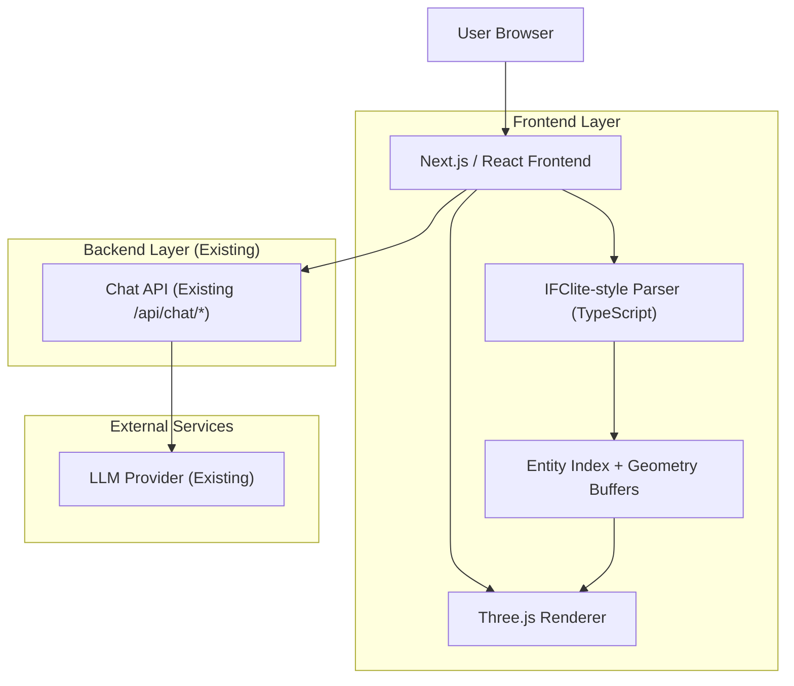
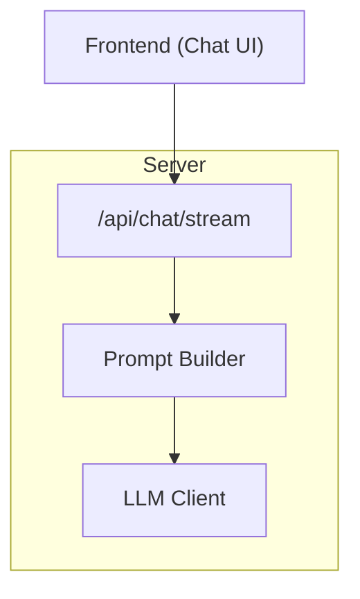

## 1.Architecture design


## 2.Technology Description
- Frontend: Next.js (React@18) + TypeScript + Three.js
- Backend: Next.js Route Handlers (existing chat endpoints); no dedicated IFC geometry backend required
- WASM: None (remove IFC/WASM viewer dependency and any wasm asset delivery path for IFC viewing)

## 3.Route definitions
| Route | Purpose |
|-------|---------|
| / | Workspace page (IFC viewer + chat + soil panel) |
| /help | Help & Diagnostics page |

## 4.API definitions (If it includes backend services)
The existing chat endpoints remain the source of truth for “chat IFC queries”. The viewer change must not break request/response shapes used by the chat UI.

### 4.1 Shared TypeScript types (frontend + backend)
```ts
export type IfcGlobalId = string;

export type IfcSelectionContext = {
  globalId?: IfcGlobalId;
  ifcType?: string;
  displayName?: string;
  // Optional: a small, safe-to-send subset of properties
  props?: Record<string, string | number | boolean | null>;
};

export type ChatIfcQueryRequest = {
  message: string;
  selection?: IfcSelectionContext;
  // Optional: client-side extracted facts to keep prompts small
  modelSummary?: {
    schema?: string; // e.g., IFC2X3 / IFC4
    elementCountsByType?: Record<string, number>;
  };
};

export type ChatStreamChunk = {
  type: "token" | "final" | "error";
  text?: string;
  errorMessage?: string;
};
```

### 4.2 Non-WASM IFC parsing module (frontend-only)
**Key design goals**
- Parse IFC STEP text into an entity map (id -> entity) without WebAssembly.
- Provide an incremental/progressive pipeline: tokenize -> parse entities -> build indices -> generate geometry.
- Keep UI responsive by running heavy work in a Web Worker.

**Suggested module boundaries (TypeScript)**
- `StepTokenizer`: converts text -> tokens
- `IfcStepParser`: tokens -> entities
- `IfcIndex`: lookup by id/type/spatial structure; supports search
- `IfcGeometryBuilder`: supports a prioritized subset of IFC geometry (fallback to bounding boxes for unsupported)
- `IfcModelStore`: cached model summary + selection state

**Performance and safety notes**
- Use Web Worker for parsing and geometry building; main thread only handles rendering and UI state.
- Use transferable objects (ArrayBuffer) for geometry buffers when possible.
- Add hard limits and early exits for extremely large files (configurable “max entities”, “max triangles”).

## 5.Server architecture diagram (If it includes backend services)


## 6.Data model(if applicable)
No database changes are required for the viewer migration.

### Soil depth constraint (UI rule)
- Enforce a fixed depth window: **minDepth = 1.0m, maxDepth = 2.0m**.
- Any slider/input controls must be either removed or clamped to the range.
- Any dataset containing other depths must be filtered before charting/rendering.