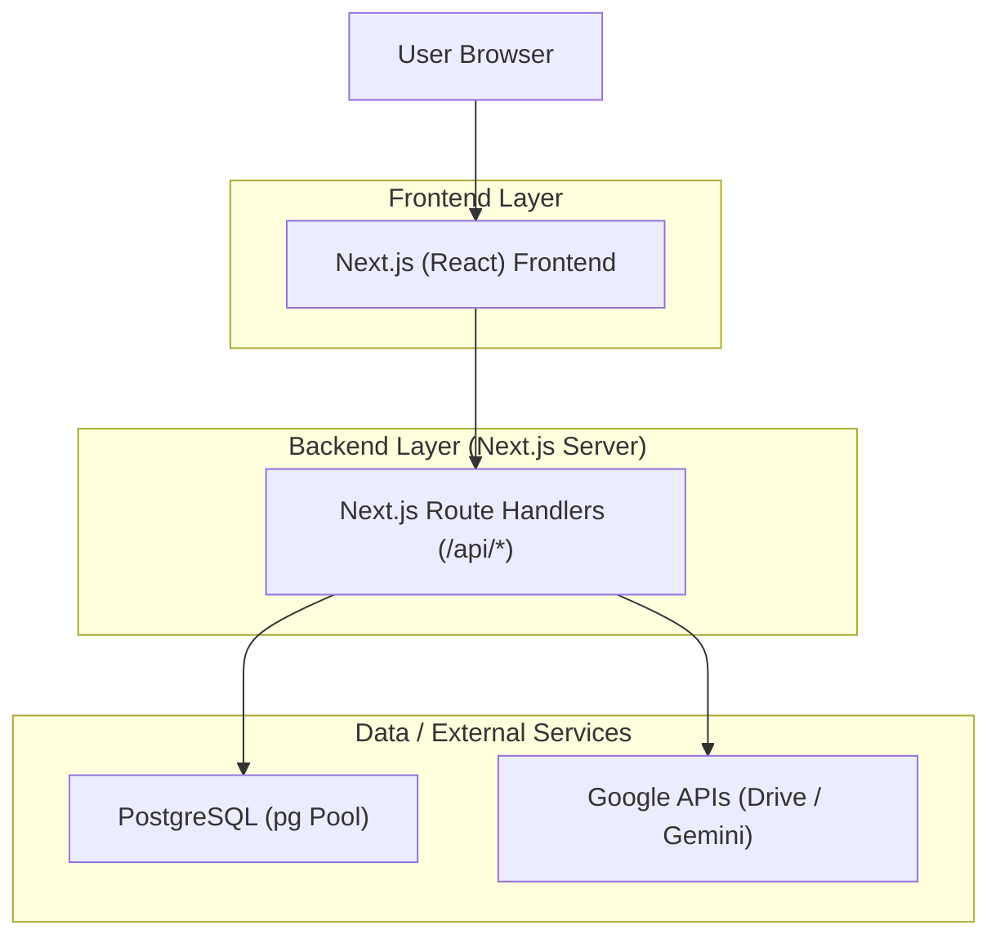

## 1.Architecture design



## 2.Technology Description

* Frontend: Next.js\@14 + React\@18 + tailwindcss\@3 + Radix UI

* Backend: Next.js Route Handlers (App Router)

* Database: PostgreSQL via `pg` connection pool

* External APIs (optional / existing): Google APIs (Drive) + Gemini model discovery/chat endpoint

## 3.Route definitions

| Route                   | Purpose                                                          |
| ----------------------- | ---------------------------------------------------------------- |
| /                       | Single-page dashboard shell with in-app navigation between views |
| /api/db/health          | DB connectivity check (used for production diagnostics)          |
| /api/sites              | Sites list / GeoJSON feed for map/visualization use              |
| /api/sites/\[id]        | Single site fetch                                                |
| /api/chat               | Proxy to Gemini-related calls (requires server-side API key)     |
| /api/drive/list         | List files in Drive (requires server-side credentials)           |
| /api/drive/upload       | Upload to Drive (requires server-side credentials)               |
| /api/islamabad/boundary | Boundary dataset endpoint                                        |
| /api/islamabad/sample   | Sample dataset endpoint                                          |

## 4.API definitions (If it includes backend services)

### 4.1 Shared types (TypeScript)

```ts
export type HealthStatus = {
  ok: boolean;
  db?: { connected: boolean };
  error?: string;
};

export type ApiError = {
  message: string;
  code?: string;
  retryable?: boolean;
};
```

### 4.2 Core API behavior requirements

* All `/api/*` endpoints return JSON with consistent error shape on failure (status code + `ApiError`).

* Production connectivity must be validated via:

  * Database: `/api/db/health` uses pool query with timeout.

  * External APIs: fail fast with clear errors when keys/credentials are missing.

* Sensitive credentials (e.g., `GOOGLE_API_KEY`, Google service credentials, `DATABASE_URL`) must exist only server-side (no `NEXT_PUBLIC_*` exposure).

## 5.Server architecture diagram (If it includes backend services)

```mermaid
graph TD
  A["Client (React Components)"] --> B["Route Handler"]
  B --> C["Connectivity / Env Validation"]
  B --> D["DB Pool (pg)"]
  B --> E["External API Client"]

  subgraph "Next.js
```

